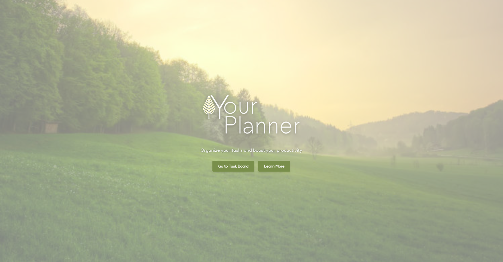
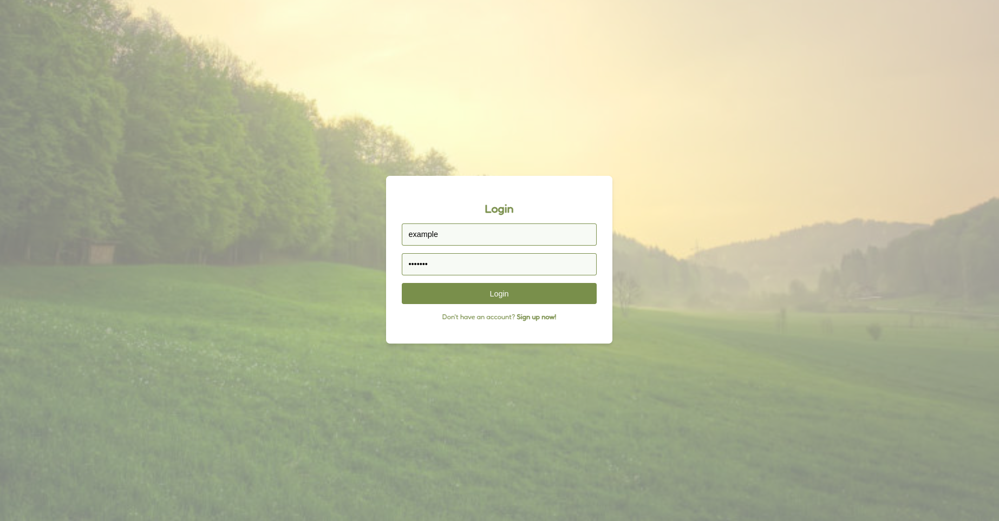
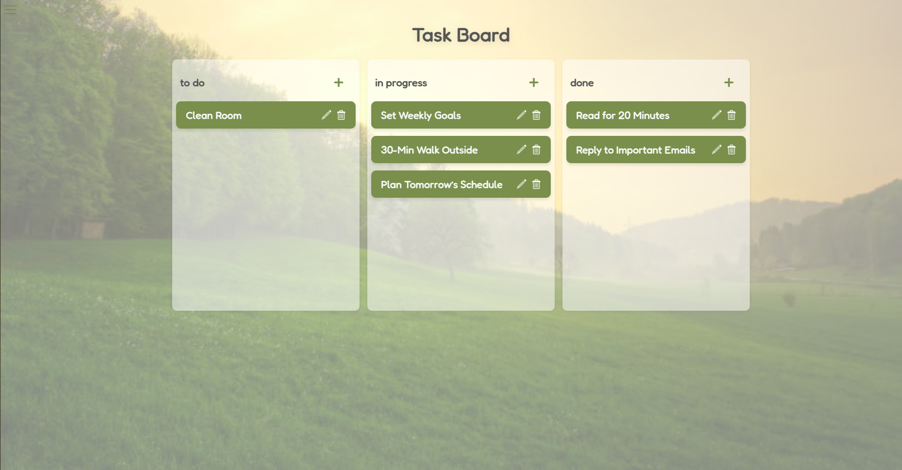
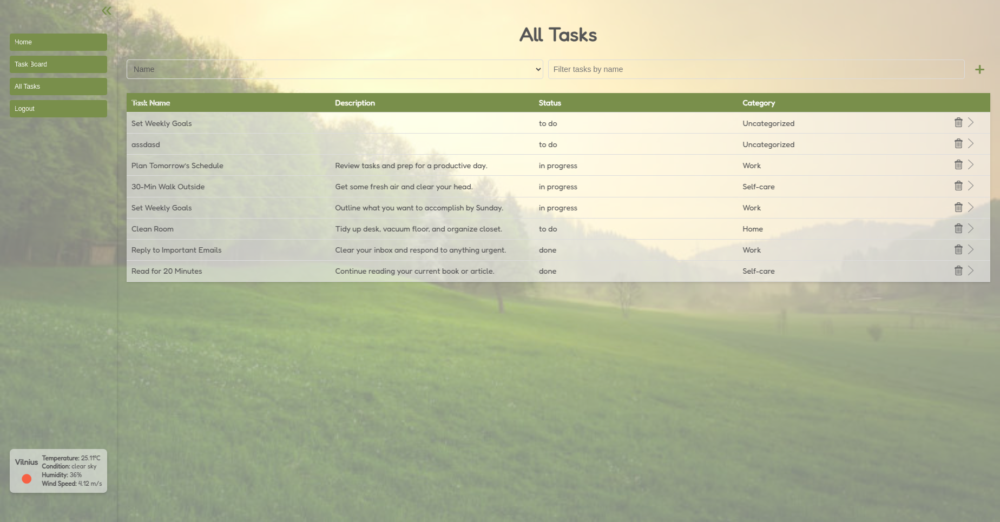
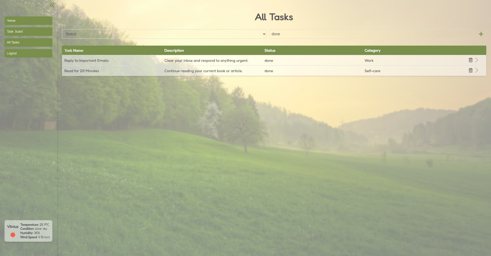
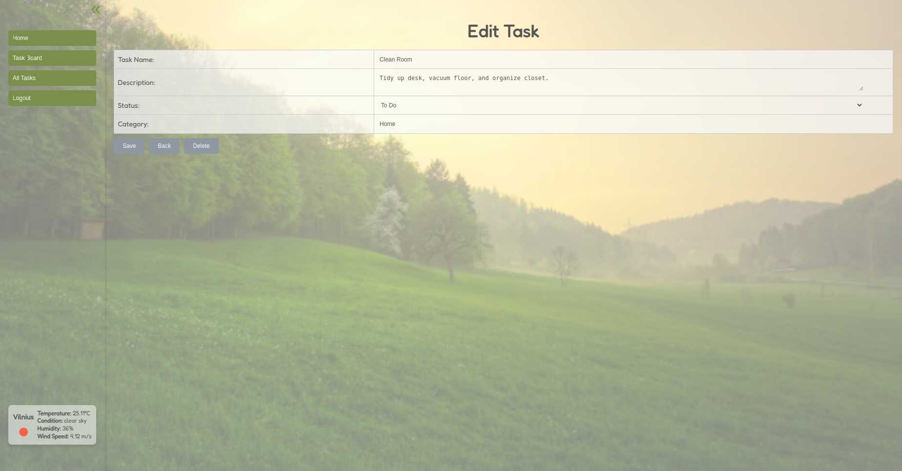

# Your Planner – Frontend

**Your Planner** is a personal task management app featuring a visual taskboard, CRUD functionality, and user authentication. It’s built as a full-stack application, showcasing modern frontend development with React and a Django backend.

PostgreSQL database, backend and frontend are all deployed on Railway.

You can find deployed application here:
https://your-planner-fe-production.up.railway.app/

You can register yourself or use example user:<br>
**Username:** example<br>
**Password:** example

<br>

## ✨ Features

- User registration, login, and logout
- Add, edit, and delete tasks (in Task board or All tasks pages)
- Visual taskboard with **drag & drop** between columns
- View all tasks in a interactive table format ("All Tasks")
- Filter tasks by name/category/status/description in All Tasks
- Collapsable toolbar for more space
- Integrated with a Django REST API

<br>


## 🛠️ Tech Stack

- **React** – component-based frontend
- **React Router** – routing between views
- **Axios** – API requests
- **React Beautiful DnD** – drag & drop functionality
- **useState, useEffect, etc.** - for state 

<br>

## 🚀 Getting Started (Local)

### 1. Clone the repository
```bash
git clone https://github.com/pusilvija/your-planner-fe.git
cd your-planner-fe
```
### 2. Install dependencies
```bash
npm install
```

### 3. Create a .env file
Copy the .env.example file and provide required variables:

**REACT_APP_RAILWAY_PUBLIC_DOMAIN** - for deploying in railway (only for prod)
**REACT_APP_WEATHER_API_KEY** - for weather data.

### 4. Start the development server

```bash
npm start
```
The app will run at http://localhost:3000 (or similar, depending on your setup).

<br> 

## 🔗 Backend Repository
Backend code can be found [here](https://github.com/pusilvija/your-planner).

<br>

## 📸 Some screenshots from application

### Landing Page view


### Login view


### Taskboard View


### All Tasks View


### All Tasks View - Filter


### Tasks Details View

