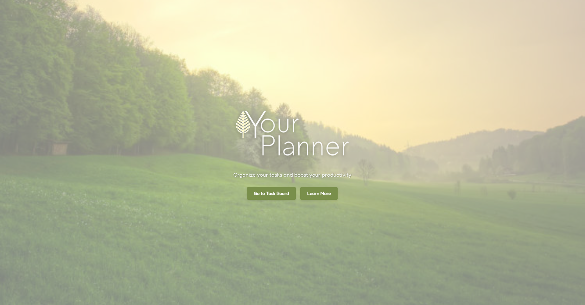
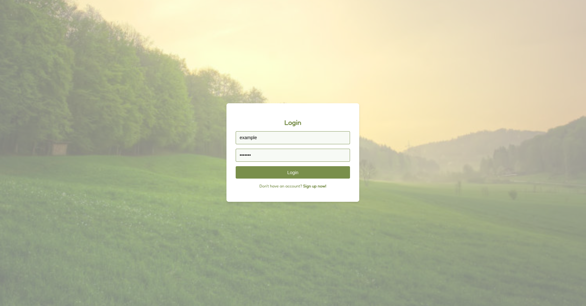
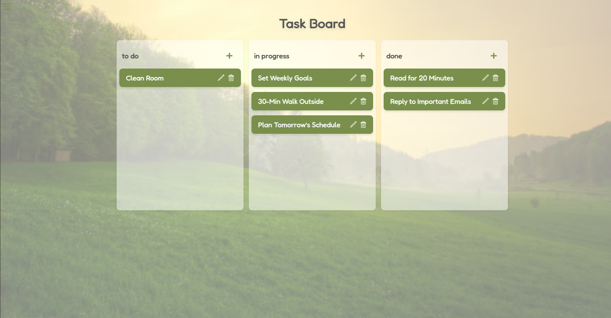
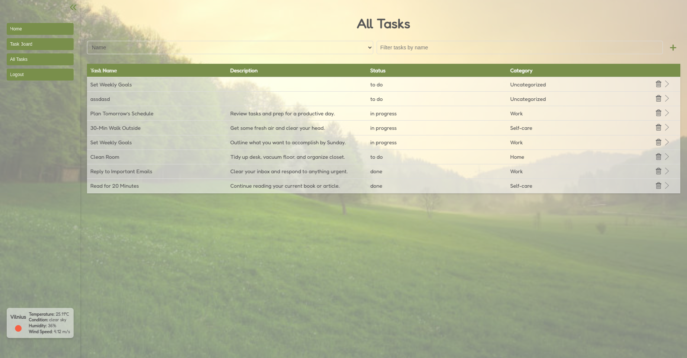
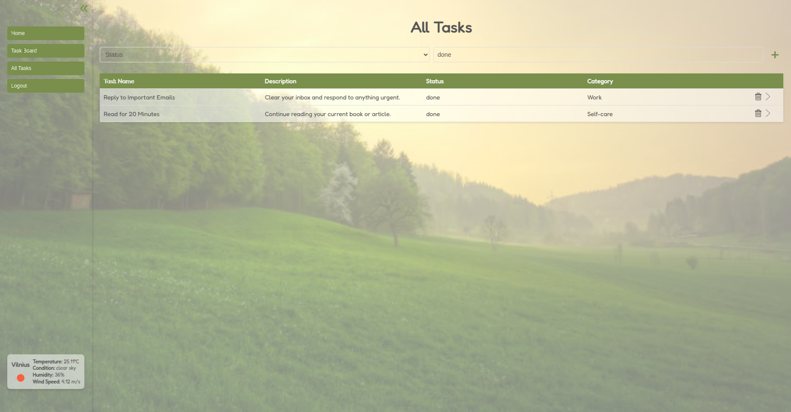
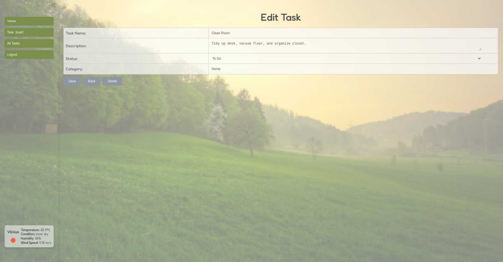

# Your Planner – Frontend

**Your Planner** is a personal task management app featuring a visual taskboard, CRUD functionality, and user authentication. It’s built as a full-stack application, showcasing modern frontend development with React and a Django backend.

PostgreSQL database, backend and frontend are all deployed on Railway.

You can find deployed application here:
https://your-planner-fe-production.up.railway.app/

You can register yourself or use a demo user:<br>
**Username:** example<br>
**Password:** example

<br>

## ✨ Features

- User registration, login, and logout
- Add, edit, and delete tasks (in Task board or All tasks pages)
- Visual taskboard with **drag & drop** between columns
- View all tasks in a interactive table format ("All Tasks")
- Filter tasks by name/category/status/description in All Tasks
- Collapsable toolbar for more space
- Integrated with a Django REST API
- Each user data is saved in PostgreSQL database

<br>

## 🛠️ Tech Stack

- **React** – component-based frontend
- **React Router** – routing between views
- **Axios** – API requests
- **React Beautiful DnD** – drag & drop functionality
- **useState, useEffect, etc.** - for state
- **Django** - for backend
- **Docker** - for deploying in Railway

<br>

## 🚀 Getting Started (Local)

### 1. Clone the repository

```bash
git clone https://github.com/pusilvija/your-planner-fe.git
cd your-planner-fe
```

### 2. Install dependencies

```bash
npm install
```

### 3. Create a .env file

Copy the .env.example file and provide required variables:

**REACT_APP_RAILWAY_PUBLIC_DOMAIN**: The public domain for the Railway deployment (used in production).
**REACT_APP_WEATHER_API_KEY**: API key for fetching weather data.

### 4. Start the development server

```bash
npm start
```

The app will run at http://localhost:3000 (or similar, depending on your setup).

<br>

## 🚀 Deployment Process

The deployment process for **Your Planner** is automated using GitHub Actions and Docker. Here's how it works:

### 1. Deployment Trigger

- The deployment is triggered automatically whenever changes are pushed to the `release` branch.

### 2. Build and Push Docker Image

- A GitHub Actions workflow (`.github/workflows/deploy-on-release.yml`) is executed.
- The workflow performs the following steps:
  1. **Checkout Code:** The latest code from the `release` branch is checked out.
  2. **Log in to Docker Hub:** The workflow logs in to Docker Hub using credentials stored in GitHub Secrets.
  3. **Build Docker Image:** A Docker image is built using the React app's source code and environment variables (`REACT_APP_RAILWAY_PUBLIC_DOMAIN` and `REACT_APP_WEATHER_API_KEY`) passed as build arguments.
  4. **Push Docker Image:** The built Docker image is pushed to Docker Hub with the tag `release`.

### 3. Trigger Railway Deployment

- After the Docker image is pushed, the workflow triggers a deployment on **Railway** using a custom Node.js script (`trigger-railway-deploy.js`).
- The script uses the following secrets to authenticate and deploy:
  - `RAILWAY_TOKEN`: Authentication token for Railway.
  - `RAILWAY_ENVIRONMENT_ID`: The ID of the Railway environment to deploy to.
  - `RAILWAY_SERVICE_ID`: The ID of the Railway service to update.

### 4. Deployment Outcome

- The updated Docker image is deployed to the Railway platform, making the latest version of the app available at:
  [https://your-planner-fe-production.up.railway.app/](https://your-planner-fe-production.up.railway.app/)

---

### **Environment Variables**

The following environment variables are required for the deployment process:

- **`REACT_APP_RAILWAY_PUBLIC_DOMAIN`**: The public domain for the Railway deployment (used in production).
- **`REACT_APP_WEATHER_API_KEY`**: API key for fetching weather data.

These variables are securely stored in GitHub Secrets and passed to the Docker build process.

<br>

## 🔗 Backend Repository

Backend code can be found [here](https://github.com/pusilvija/your-planner).

<br>

## 📸 Some screenshots from application

### Landing Page view



### Login view



### Taskboard View



### All Tasks View



### All Tasks View - Filter



### Tasks Details View


